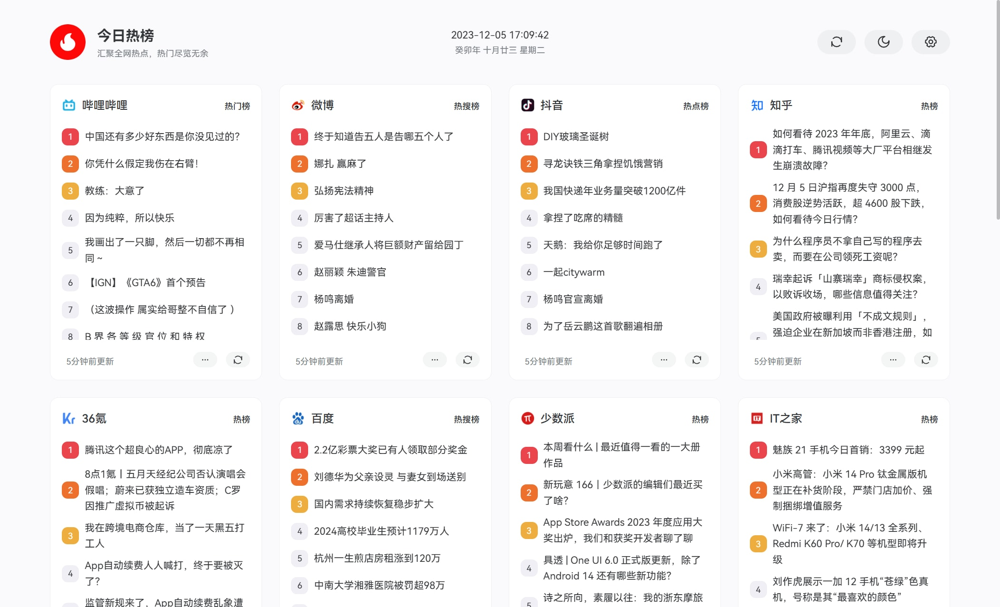

<div align="center">

<h2>今日热榜</h2>
<p>汇聚全网热点，热门尽览无余</p>
<br />

</div>


## 示例

> 这里是示例站点

- [今日热榜 - https://hot.imsyy.top/](https://hot.imsyy.top/)


## 部署

```bash
// 安装依赖
pnpm install

// 开发
pnpm dev

// 打包
pnpm build
```

## Vercel 部署

现已支持 Vercel 一键部署，无需服务器

> 请注意，需要修改环境变量中的 API 地址


